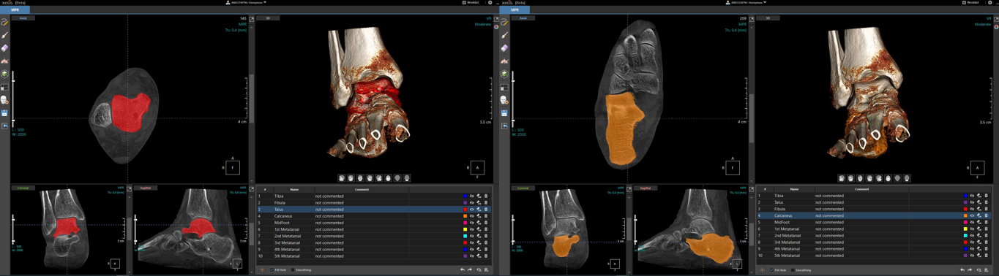

# Unet-segmentation

## Introduction
This repo is for checking data validation of NIA-2023 Joint and Arthritis Datasets. This repo is contain training code and evalutation code related with segmentation task.

## Dependencies
* [Pytorch 1.11.0](https://pytorch.org/get-started/previous-versions/)
* [CUDA](https://developer.nvidia.com/cuda-downloads)
* [cuDNN](https://developer.nvidia.com/cudnn)

## Directory
### Root
Repository directory structure is like bellow.
```
${ROOT}
|-- common
|    |-- utils
|-- configs
|-- dataset
|-- models
|-- tools
`-- output
```
* `common` contains utility code for project.
* `configs` contains configure files like hyper-parameters for training model.
* `dataset` contains data loading codes.
* `models` contains model network.
* `tools` contains supporting code like data sampling or data spliting.
* `output` contains trained model, visualized output.

## Runing codes

### Start
* Run `pip install -r requirements.txt` to install required libraries.
* You have to check and modify `constants.py` for setting data root. 

### Prepare datasets
#### Data prepare (only for uwmgi dataset)
```shell
python3 tools/data_preprocessing.py --img_path [IMG_DIR] --anno_path [ANN_DIR] --output_path [OUPUT_FILE_PATH] 
```
#### Data sampling
```shell
python3 tools data_sampling_segmentation.py
```
#### Data split for making train, validation, test data
```shell
python3 data_split_segmentation.py --data_tag [AXL or COR or SAG]
```

### Train
In the root folder, please run like bellow. If you want to track with wandb, add use_wandb option.
```shell
# example: python3 train.py --dataset nia --cfg configs/config.yaml --gpus 0,1,2,3 --data_tag COR --use_wandb
python3 train.py --dataset [DATASET_NAME] --cfg [CONFIG_FILE_PATH] --gpus [GPU_IDS] --data_tag [AXL or COR or SAG]
```

### Evaluate
```shell
# example: python3 eval.py --checkpoint output/model_dump/snapshot_AXL_150.pt --dataset nia --data_tag AXL
python3 eval.py --checkpoint [MODEL_FILE_PATH] --dataset [DATASET_NAME] --data_tag [AXL or COR or SAG] --is_vis [Visual Flag]
```
